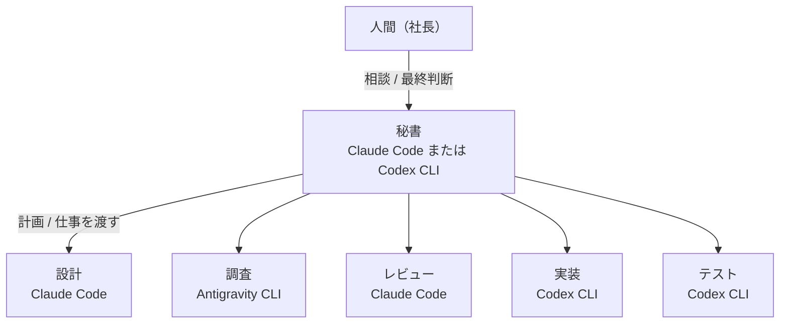

# MultiAIAgentCompany 🏢

> **人間は「社長」、対話するのは「秘書」ただ1人。**
> 複数の AI コーディングエージェント（Claude Code / Codex CLI / Antigravity CLI）を「会社の部門」に見立てて、仕事を受け渡しさせるデスクトップアプリ。

[](https://dotnet.microsoft.com/)
[](https://avaloniaui.net/)
[](https://www.apple.com/macos/)
[](LICENSE)

---

## 🌟 概要

**MultiAIAgentCompany** は、対話型の AI コーディングエージェントを「会社の各部門」に見立てて協調させる macOS アプリです。

人間がすべてのエージェントと個別にやり取りするのではなく、**秘書**に要件を伝えます。秘書が計画を立て、設計・実装・調査・レビュー・テストの各部門へ仕事を渡します。

人間はチャットを中継する「伝書鳩」から解放され、**要所の意思決定**（承認・質問への回答・報告を受理するか差し戻すか）に集中できます。



部門の顔ぶれと担当 CLI は、既定値から画面で変えられます（後述）。

---

## 💡 考え方

### 1. 会話ではなく、ファイルで仕事を受け渡す

エージェント同士の伝言ではなく、ワークスペース内の `.company/` に置いた **Markdown / JSON の文書**（指示書・報告書・相談・状態）で、非同期に仕事を受け渡します。

アプリが落ちても、**仕事と進捗はファイルとしてディスクに残ります**。ただし「送ったかどうか分からない仕事」を勝手に送り直すことはしません —— 起動時に**人間に確かめてもらう**形にしています（二重実行を避けるため）。

### 2. フォルダを複製しない。書き込み権で順番を守る

Git worktree のようにフォルダを複製せず、**1つのフォルダを共有**します。そのかわり、ワークスペースに1つの**書き込み権（`lease.json`）**で、同時に書く部門を1つに制限します。

Unity のように「プロセスがフォルダを掴んでいる」「キャッシュが大きくて複製できない」プロジェクトでも使えることを狙っています。

### 3. 承認は、人間がターミナルで押す

各部門は **macOS の Terminal.app で対話起動**します。CLI 本来の画面（思考の過程、差分のプレビュー、承認プロンプト）を見ながら、**人間がその窓で承認**します。

アプリは承認を代行しません。**承認を全部飛ばすモード（`--dangerously-skip-permissions` など）は選べません。**

CLI 自身が持つ「自動」系のモード（Claude Code の `auto`、Codex の自動レビュー）は、部門ごとに選べます（後述）。既定は CLI の設定のままです。

---

## 🖥️ 画面構成（3ペイン）

| ペイン | 役割と主な機能 |
| :--- | :--- |
| **左**<br>相談の一覧 | ・**相談スレッド**: 「＋ 新しい相談」と過去の相談<br>・**片付ける**: 選んでいる相談を、消さずに `.company/archive/threads/` へ移す<br>・**確かめてほしいこと**: 起動時に、送ったかどうか分からない仕事や読めない書き込み権を出し、人間が「送り直す / 取り消す」を決める<br>・**作業ログ**: 下に畳んである実行ログ（ドラッグで選んでコピーできる） |
| **中央**<br>秘書との会話 | ・**秘書との会話**: 入力欄から相談（Enter で送信）<br>・**計画の進行**: 秘書が立てた計画（例: 調査 → 設計 → レビュー → 実装）を、アプリが順に進める<br>・**報告の即時表示**: 部門が `report.md` を書くと、中央に表示 |
| **右**<br>部門 | ・**部門タイル**: 状態を3つの軸（稼働 / 活動 / 仕事）で分けて出し、根拠と、いま抱えている仕事の件名を添える。並び順は部門の設定で変えられる<br>・**ロボットのアイコン**: 活動状態に応じた 6 ポーズ（3頭身のロボット）。選んだ部門は大きく出る<br>・**操作**: ターミナルを前面に出す、この部門に仕事を作る、報告を受理する / 差し戻す、仕事を取り消す<br>・**AI の残量**: 下に畳んであるパネル。Claude Code / Codex / Antigravity の 5 時間枠・週枠の残りとリセット時刻 |

---

## 🚀 主な機能

- **🏢 既定の部門**:

  | 部門 | Id | CLI | 備考 |
  | :--- | :--- | :--- | :--- |
  | 設計 | `design` | Claude Code | |
  | 実装 | `implementation` | Codex CLI | |
  | 調査 | `research` | Antigravity CLI | |
  | レビュー | `review` | Claude Code | |
  | テスト | `testing` | Codex CLI | |
  | 設計レビュー（整合） | `design-review-consistency` | Codex CLI | 読むだけ（書き込み権を取らない） |
  | 設計レビュー（外から） | `design-review-outside` | Antigravity CLI | 読むだけ |

- **🔄 計画の自動進行と差し戻し**:
  - 前の工程の報告を、**要約せずそのまま**次の工程の指示書に入れて渡す
  - レビュー部門の判定行（`verdict: ok` / `verdict: revise`）を読み、直しが要れば見てもらった工程へ差し戻す。**差し戻しは既定で 3 回まで**。超えたら止めて人間を呼ぶ
  - **最後の工程の報告だけは、人間が受理する**

- **⚙️ 部門の設定画面**（メニュー「ファイル → 部門の設定…」）:
  - 部門の追加・編集・削除・**並べ替え**（右ペインのタイルもその順になる）、担当 CLI、**モデル**、**思考の強さ**、**権限モード**
  - **秘書の CLI も選べる**（Claude Code / Codex CLI）
  - **モデルの候補は CLI から取る**: Codex は `codex debug models`、Antigravity は `agy models`。**モデルごとに使える強さだけ**を候補にする（設定できるのに起動しない組み合わせを作らない）
  - CLI ごとの渡し方の違いを吸収（Claude は `--effort`、Codex は `-c model_reasoning_effort=…`、Antigravity は強さがモデル名に含まれる）
  - 終わっていない仕事・計画からの参照・書き込み権がある部門は、消せない（理由を全部出す）

- **🔐 部門ごとの権限モード**（起動時のモード。**その CLI が持っているものだけ**選べる）:

  | CLI | 選べるモード |
  | :--- | :--- |
  | Claude Code | 自動 / 手動 / 編集を受け入れる / プラン（`--permission-mode`） |
  | Codex CLI | 自動（`--approve-for-me`。承認を Codex の自動レビューに回す） |
  | Antigravity CLI | 編集を受け入れる / プラン（`--mode`） |

  - Claude Code は**モデルによって黙って通常モードに戻る**ことがある（例: haiku で「自動」を選ぶと通常モードで起動する）。設定画面で選ぶと、会話を使わずに CLI に確かめ、効かなければその場で知らせる
  - 効くのは外部ターミナルで起動する部門だけ

- **📊 AI の残量**（右ペイン下のパネル）:
  - 開いたときと「更新」を押したときだけ取る（自動で繰り返さない）。**3つとも会話を消費しない方法**で取る
  - Claude Code は `claude -p "/usage"`、Codex は `codex app-server` の `account/rateLimits/read`、Antigravity は `agy -p "/quota"`
  - 読めなかったときは、残量ゼロとせず理由と CLI の出力をそのまま出す

- **🛡️ 会話の記録を git に入れない**:
  - 作業するフォルダが git リポジトリで、`.company/` が無視されていなければ、開いたときに **`.gitignore` に足すか聞く**（黙って書き換えない）
  - 「このフォルダでは聞かない」を選ぶと `.company/gitignore-declined` に覚える（消すとまた聞く）

- **🤖 ロボットの一言**:
  - 何も無いときの画面や、部門の絵のツールチップで、ロボットが少ししゃべる。報告を受理するとおじぎする
  - **人間の出番があるとき（承認・質問・受理待ちなど）は遊ばない**

- **🎨 見た目**:
  - ライト / ダーク両対応
  - 英数字は Inter、**Inter に無い字は Hiragino Sans** で描く（ツールチップのような窓の外の小窓も含む）
  - 人間の出番があるタイルにだけ色が付く

---

## 🛠️ 動作要件

- **OS**: macOS（**macOS 26.5 / Apple Silicon で動作確認**。Intel Mac は未確認）
  - **Windows / Linux は未対応です。** 部門を外部ターミナルで開く部分が macOS の Terminal.app 専用のためです
- **.NET 10 SDK**（ビルドに必要）
- **使う CLI**（使う部門のぶんだけ）:
  - [Claude Code](https://docs.anthropic.com/en/docs/agents-and-tools/claude-code/overview)（`claude`）
  - [Codex CLI](https://github.com/openai/codex)（`codex`）
  - [Antigravity CLI](https://antigravity.google)（`agy`）
- 各 CLI が**ログイン済み**で、作業するフォルダを**信頼済み（trust）**にしてあること。アプリは trust を書き換えません（画面上部に状態を出します）

---

## 📦 ビルドと実行

```bash
git clone https://github.com/tyashushi/MultiAIAgentCompany.git
cd MultiAIAgentCompany
```

```bash
dotnet build MultiAIAgentCompany.slnx
```

```bash
dotnet test MultiAIAgentCompany.slnx
```

実物の CLI を起動するテスト（課金とネットワークを伴う）は、**既定ではスキップ**されます。走らせるときは `MAC_LIVE_CLAUDE=1` / `MAC_LIVE_CODEX=1` / `MAC_LIVE_AGY=1` / `MAC_LIVE_PLAN=1` を指定します。

```bash
dotnet run --project src/MultiAIAgentCompany.Desktop/MultiAIAgentCompany.Desktop.csproj
```

`dotnet run` では Dock のアイコンが dotnet のものになります。アプリのアイコンで起動したいときは、`.app` バンドルを作ります:

```bash
spikes/app-bundle/make-app.sh
```

---

## 📖 使い方

1. **フォルダを選ぶ**: 中央上の「フォルダを選ぶ」か `Cmd+O` で、作業するリポジトリを選ぶ。前回のフォルダは次の起動で開き直す。git リポジトリなら、`.company/` を `.gitignore` に足すか聞かれる
2. **秘書に相談する**: 中央の入力欄から話しかける（例: 「ログイン機能を設計して、実装まで進めて」）
3. **仕事が部門へ渡る**: 秘書が計画を立てると、最初の部門の仕事ができ、Terminal.app の窓が開く
4. **ターミナルで承認する**: その窓で、エージェントの作業と承認プロンプトを見て、人間が承認する
5. **質問が来たら答える**: 部門が判断に迷うと `question.md` を書いて止まる。その窓で答えれば続きをやる
6. **報告を受け取る**: 部門が `report.md` を書くと中央に出る。計画の途中の工程はアプリが受理して次へ進め、**最後の工程だけ人間が受理する**

---

## 📁 `.company/` の構造

作業するフォルダの直下に `.company/` を作り、状態をすべてファイルで持ちます:

```text
<ワークスペース>/.company/
  departments.json        # 部門定義（並び順・担当 CLI・モデル・思考の強さ・権限モード・秘書の設定）
  gitignore-declined      # 「.gitignore に足すか聞かない」を選んだときだけできる
  lease.json              # 書き込み権（ワークスペースに1つ）
  README-department.md    # 部門への約束（報告や質問の書き方）
  secretary/
    README.md             # 秘書への約束
    threads/<id>/         # 相談スレッド（meta.json / transcript.jsonl）
    outbox/               # 秘書が出した提案
    processed/            # 受理・却下した提案（消さずに移す）
  plans/<plan-id>/
    plan.json             # 秘書が立てた計画と、各工程の進み具合
  tasks/<task-slug>/
    instruction.md        # 指示書
    report.md             # 報告書
    question.md           # 部門からの質問
    answer.md             # 人間の回答
    rejection.md          # 差し戻しの理由
    next-instruction.md   # 次の試行の指示（差し戻しのとき）
    attempts/<n>/         # 過去の試行（消さずに封じる）
    state.json            # 仕事の状態・試行番号・revision
  archive/threads/        # 片付けた相談
  unreadable/             # 読めなかった仕事（消さずに移す）
```

`.company/` は対象のワークスペースの記録で、このリポジトリの成果物ではありません（`.gitignore` 済み）。

---

## ⚠️ 既知の制限

- **macOS 専用**（上記）。Windows 対応は予定しています
- **配布用のアプリはまだありません。** .NET 10 SDK でビルドして使ってください（GitHub のリリースで `.app` を配布する予定です）
- **画面と文書は日本語のみ**です
- **動作を確かめた環境は 1 台**（macOS 26.5 / Apple Silicon）です
- **Claude Code のモデル一覧は取れません。** Claude の部門のモデルは打ち込みです（`opus` / `sonnet` などの別名も使えます）。思考の強さの候補は CLI から取ります
- **Terminal.app はスクリプトからタブを作れない**ので、部門は別々の窓で開きます。窓の見分けは、タイルの「ターミナルを前面に出す」で行います
- アプリを再起動したあと仕事を送り直すと、**同じ部門の窓が2つ並ぶ**ことがあります（古い方は空のシェルです）
- 外部ターミナルで動く部門は、アプリから**活動状態（作業中か休憩中か）を観測できません**。タイルには「分からない」と出ます

---

## 📚 設計について

コード中のコメントにある「設計 §NN」は、**非公開の設計文書**の節番号です（何を決め、なぜそうしたか、実機で何を測ったかを記録したもの）。リポジトリには含めていません。読める形にまとめたものを、別途公開する予定です。

---

## 📄 ライセンス

[MIT License](LICENSE)
